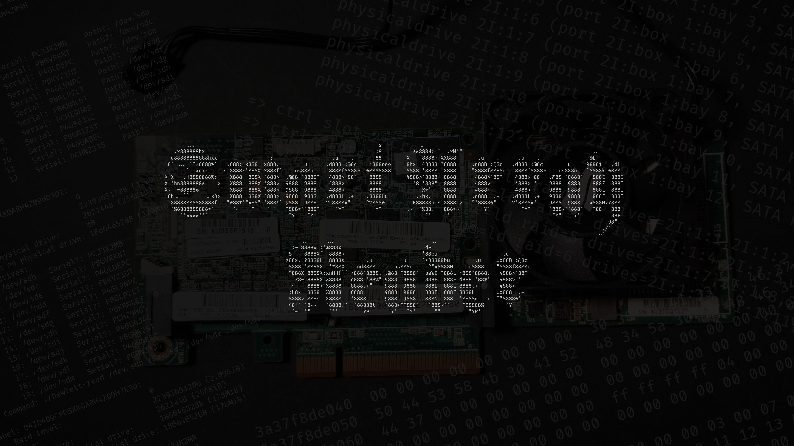
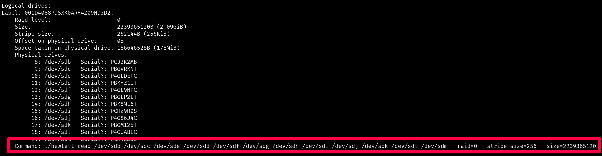

# HP SMART ARRAY RAID READER
<p align="center">
    
    <i>Wait, since when does P420 have a fan? Since I used a superglue!</i>
</p>

> I hope you and I will never have to use this program.

> Everything was implemented and tested using HP Smart Array P420 with 8.00-0 firmware version. I don't know if it will work correctly for arrays operated with different controller or firmware version.

You had very nice Hardware RAID 6 array operated with HP Smart Array Controller but the controller have died? Now you have to buy new controller and wait 'til it arrives and pray for it to work in order to recover your precious data? **NOT ANYMORE**. Here it is brand new tool to read smart drive arrays on Linux!

## Compiling
You need to install `nbd` client, at least BUSE documentation says you have to. On Arch Linux it's `pacman -S nbd`.

Sorry, I can't into `make`, so to compile you just do
```sh
./build.sh
```
and wait for ages for it to compile.

## Usage
First load `nbd` kernel module:
```sh
sudo modprobe nbd
```
Then use `packard-tell` to identify logical drives on the array:
```sh
./packard-tell /dev/sdb /dev/sdc /dev/sdd /dev/sde
```
If some of your drives failed you don't have to provide them, packard-tell will figure out which drives are missing. Example:


> Note: If some property returned from `packard-tell` is followed by `?` for example `Serial?` then that means I am not sure if it's 100% correct. For my case it was correct ^^

After you found logical drive that you want to mount use command provided by `packard-tell`  
It will assemble the array and expose it on `/dev/nbd0`. This is readonly. Use lsblk to identify if there are any partitions. Now you can mount with `mount -o ro`, for example:
```sh
mount -o ro /dev/nbd0p1 /mnt/d1 --mkdir
```
Remember to include `-o ro`, otherwise you will get an error as `hewlett-read` exposes raid array as readonly.

If you want to use other `nbd` target then you can use `--out` option on `hewlett-read` command, for example `--out /dev/nbd1`.

If your metadata are destroyed you can use `hewlett-read` directly, if you don't provide size it will use maximum size possible. It won't read last `32MB` from drives tho, coz metadata lays there and I just ignore that section. Example:
```sh
./hewlett-read --raid=5 /dev/sdc /dev/sdd /dev/sdf
```
If one drive has failed replace it's path with `X`:
```sh
./hewlett-read --raid=5 /dev/sdc X /dev/sdf
```

Of course you have to remember, RAID 0 can't have failed drives, RAID 5 only one, RAID 6 only two\*

> \* *For RAID 6 only 1 missing drive recovery works at this moment. - see [Raid 6 problem](./raid-6-problem)*

## Features
- Reading and parsing controller metadata
- Assembling RAID 0, 1, 5, 6, 10, 50, 60
- Supports multiple logical drives on single array
- Supports recovery in case of failed drive in RAID 1, 5 and 6
- Supports recovery in case of failed drive for each mirror group in RAID 10
- Supports recovery in case of failed drive for each pairty group in RAID 50 and 60

## Caveats
- Sometimes it doesn't read correctly very end of drive, last full stripe to be precise. I don't really know why, sorry. This shouldn't be a problem until you filled up your RAID array to the very last megabyte.

## TODO
- [ ] RAID 6 with 2 missing drives - see [Raid 6 problem](./raid-6-problem)

## Libraries used
[BUSE](https://github.com/acozzette/BUSE) - :purple_heart:

## Legal
This Project is in no way affiliated with, authorized, maintained, sponsored or endorsed by HP or Hewlett Packard Enterprise or any of its affiliates or subsidiaries.

# License
GPL 3.0
